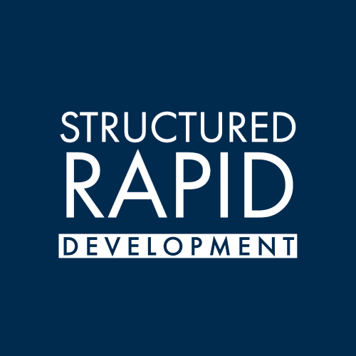
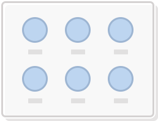
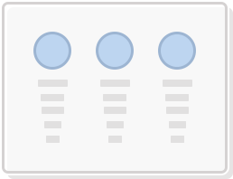
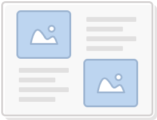
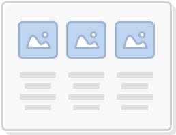
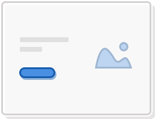
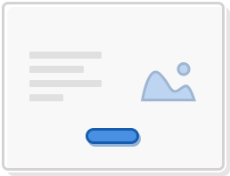
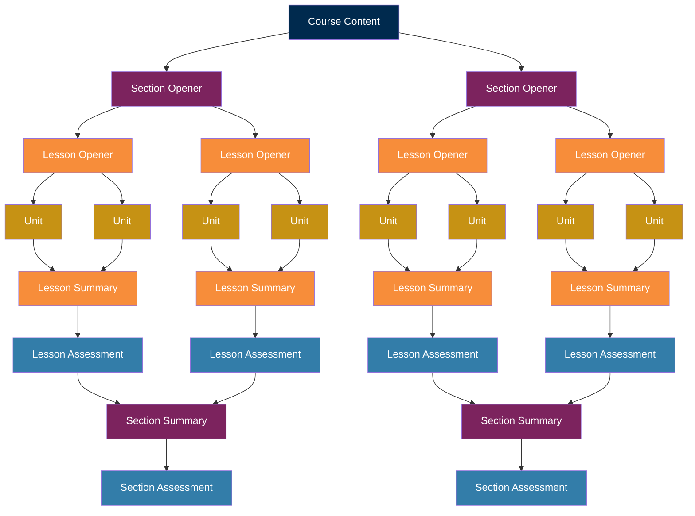

<h1 align="center">
  <a href="https://github.com/Standards-and-Practices/structured-rapid-development">
     
  </a>
</h1>

  Design Patterns to Streamline Learning Design and Development.
   
   
  <a href="https://github.com/Standards-and-Practices/structured-rapid-development/issues/new?assignees=&labels=bug&template=01_BUG_REPORT.md&title=bug%3A+">Report a Bug</a>
  ·
  <a href="https://github.com/Standards-and-Practices/structured-rapid-development/issues/new?assignees=&labels=enhancement&template=02_FEATURE_REQUEST.md&title=feat%3A+">Request a Pattern</a>
  .
  <a href="https://github.com/Standards-and-Practices/structured-rapid-development/discussions">Ask a Question</a>

WGU's vision is to be the world's most innovative, student-centric university. 

Structured Rapid Development uses these design patterns to streamline the learning product design and development.

Table of Contents

- [Pathways](#pathway-patterns) - The journey a learner will go on.
- [Learning Experiences](#experience-patterns) - Learning experiences on the journey that encourage learning.
    - [Case Patterns](#case-patterns)
    - [Practice Patterns](#practice-patterns)
    - [Problems Patterns](#problems-patterns)
    - [Design Patterns](#design-patterns)
    - [Inquiry Patterns](#inquiry-patterns)
- [Activities](./activities/README.md)
- [Screen Layouts](#screen-layouts) - What the user will actually see on their screen.
- [xBlocks](./xBlocks)

# Pathway Patterns
Pathways are organized sets of achievements that usually lead to some sort of credential (e.g. a degree, a certificate). There are several typical patterns that pathways take. 
- [Explorer](./pathways/Explorer.md) - Expose learners to a variety of topics.
- [Deep Dive](./pathways/DeepDive.md) - Increase a learner's proficiency in a single domain.

# Learning Experience Patterns
Modules are the sub-xBlocks of pathways. They could be found at the certificate, course, competency, or sub-competency level. 
## Case Patterns

- [Decision Case](./experiences/cases/DecisionCase.md) 
- [Evaluation Case](./experiences/cases/EvaluationCase.md) 
- [Problem-Diagnosis Case](./experiences/cases/ProblemDiagnosisCase.md) 
- [ ] Outlier
- [ ] Role Play
- [ ] Longitudinal

## Practice Patterns
- [Deliberate Practice](./experiences/practice/DeliberatePractice.md) 
- [ ] Scaffolded Assistance
- [ ] Distributed
- [ ] Variable

## Problem Patterns
- [Well-Structured Problems](./experiences/problems/WellStructuredProblem.md) 
- [Ill-Structured Problems](./experiences/problems/IllStructuredProblem.md) 
## Design Patterns
- [Design Thinking](./experiences/design/DesignThinking.md) 
- [ ] Maker Spaces

## Inquiry Patterns
- [Scientific Method](./experiences/inquiry/ScientificMethod.md) 
- [ ] Socratic Questioning

## Other Patterns
- [Engage, Guide, and Apply](./experiences/other/EngageGuideApply.md)

# Activites
Check out the index of our learning activites [here](./activities/README.md).
# Screen Layouts
## Article

## Blog

## Content

## Gallery

## Intro

## Media

## Other

- ~~Intro / Outro Sandwich~~ 
- ~~Check For Understanding (CFU)~~ 

# [xBlock xBlocks](./xBlocks/README.md)

# OEX Structure

# To Do
- [ ] Add anti-patterns
- [ ] Add resources
- [ ] Add examples
- [ ] Add tools
- [ ] Add videos
- [ ] Add books
- [ ] Add courses
