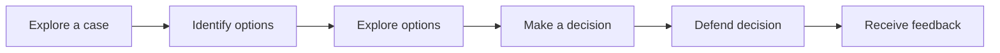

# Decision Case
Helping learners step into the shoes of a decision maker during a critical moment of decision can be an engaging way to teach both subject-matter and critical thinking. Decision-based cases are the most common type of case study.

## Pattern Structure
A learning experience implementing the Decision Case pattern typically follows the structure:

## Pattern Sizes
Decision Cases are highly scalable. A few sizes the Decision Case might include the following:  

- **Unit Case or Vignette** - Deliver a small Decision Case on a single page. This might involve nothing more than a paragraph of text or a short video clip and few formative assessment questions to guide the learner through the analysis. 
- **Section Case** - 
- **Course Case**

## 1. Explore a case
 <!-- - Engage - Recall information or give them the big picture. (Essential Questions, Hooks)
 - Explore - Explore what you know if you've already been exposed. 
 - Explain - Tell them what they're going to get out of this. -->
Select one or more of the following compatible modalities to enable learners to explore a case.

## 2. Idenfity options
- What is the decision that needs to be made in the case? 
- What are the major decision options?

## 3. Explore options
- What questions will help you decide which decision option is best for you?
- What concepts and frameworks might help answer your questions?

## 4. Make a decision
- What decision do you recommend?
- What are the major reasons that support your recommendation?
- What are the major risks of your recommended decision?

- Eisenhower Decision Matrix
## 5. Defend decision
- Arrange the criteria in order of importance, from the most to least. The evidence should show how each criterion supports your recommended decision.
- Identify the high-level goals for your action plan. In other words, how do you want the action plan to change the situation in the case?
- Organize your action plan steps. 
  - Short term
  - Long term
  - Major risks: Identify the most important one or two risks with your action plan. 
  - Mitigation of risks: How would you eliminate or reduce the risks?
## 6. Receive feedback
