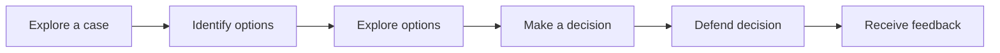

# Decision Case

# Pattern Structure
A learning experience implementing the Decision Case pattern typically follows the structure:

## 1. Explore a case
## 2. Idenfity options
## 3. Explore options
## 4. Make a decision
## 5. Defend decision
## 6. Receive feedback
