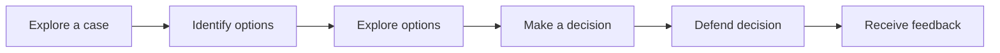

# Decision Case
Helping learners step into the shoes of a decision maker during a critical moment of decision can be an engaging way to teach both subject-matter and critical thinking. Decision-based cases are the most common type of case study.

# Pattern Structure
A learning experience implementing the Decision Case pattern typically follows the structure:

## 1. Explore a case
 <!-- - Engage - Recall information or give them the big picture. (Essential Questions, Hooks)
 - Explore - Explore what you know if you've already been exposed. 
 - Explain - Tell them what they're going to get out of this. -->

## 2. Idenfity options
## 3. Explore options
## 4. Make a decision
## 5. Defend decision
## 6. Receive feedback
