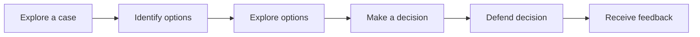
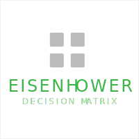

# Decision Case
Helping learners step into the shoes of a decision maker during a critical moment of decision can be an engaging way to teach both subject-matter and critical thinking. Decision-based cases are the most common type of case study.

# Possible Sizes
Decision Cases are highly scalable. A few sizes the Decision Case might include the following:  

## Unit Case
Deliver a small Decision Case on one page of content. This might simply be a paragraph of text or a short video clip and a few formative assessment questions to guide the learner through the analysis. 

<details><summary ><strong>Example 1</strong>: Unit-Sized Business Decision Case</summary>
<p>
Chris is the CEO of a small tech company. The company has been in business for 5 years and is struggling to stay afloat. Chris is faced with the decision to either lay off 10% of the company's workforce, or to invest in a new product line that has the potential to be very profitable. To make this decision, Chris evaluates the options using the SWOT (Strengths, Weaknesses, Opportunities, Threats) framework.

**Option 1: Lay off 10% of the workforce**
Consider the option to `lay off 10% of the workforce` using the SWOT framework.
```

  Strengths: This would immediately reduce costs for the company.
  
  Weaknesses: This would likely reduce morale among the remaining employees.It is possible that the company would not be able to rebound from the layoffs and would have to close its doors.  
  
  Opportunities: The company may be able to rebound from the layoffs and be more successful than ever before. This would show employees that the company is willing to make tough decisions in order to stay afloat.
  
  Threat: The company may not be able to rebound from the layoffs and would have to close its doors. This could lead to bad publicity for the company.
```

**Option 2: Invest in a new product line**
Consider the option to `invest in a new product line` using the SWOT framework.
```
Strengths: This could potentially bring in a lot of new revenue for the company It would show employees that the company is still viable and is willing to invest in its future.

Weaknesses: The new product line may not be successful. The company may not have the resources to invest in a new product line.

Opportunities: The new product line may be successful and bring in a lot of new revenue.This could show employees that the company is still viable and is willing to invest in its future.| The new product line may not be successful.
  
Threats: The company may not have the resources to invest in a new product line.
```

**Option 3: Do nothing**
```
Strengths: The company would not have to spend any additional money.

Weaknesses: The company is likely to fail if it does not take action.Employees may lose faith in the company if it does not take action.

Opportunities: The company may be able to rebound if it takes action.Employees may be more willing to work for the company if it takes action.
  
Threats: The company is likely to fail if it does not take action.Employees may lose faith in the company if it does not take action.
```

</p>
</details>

## Section Case
  Refer to Decision Case across a Section of content, aligning to a competency. 


## Course Case
Create a course around an extended case study, using aspects of a case to teach multiple competencies. 
  > **Example:** This might involve nothing more than a paragraph of text or a short video clip and few formative assessment questions to guide the learner through the analysis. 
# Pattern Structure
A learning experience implementing the Decision Case pattern typically follows the structure:


## 1. Explore a case
 <!-- - Engage - Recall information or give them the big picture. (Essential Questions, Hooks)
 - Explore - Explore what you know if you've already been exposed. 
 - Explain - Tell them what they're going to get out of this. -->
Select one or more of the following compatible modalities to enable learners to explore a case.

<a href="./explore-case/ReadACase.md">
  
</a>
<a href="./explore-case/WatchACase.md">
  
</a>
<a href="./explore-case/ListenToACase.md">
  
</a>
<a href="./explore-case/EngageInAnInteractiveCase.md">
  
</a>

## 2. Idenfity options
- What is the decision that needs to be made in the case? 
- What are the major decision options?
- [Brainstorming](https://www.sessionlab.com/methods/brainstorm-rules)

## 3. Explore options
- What questions will help you decide which decision option is best for you?
- What concepts and frameworks might help answer your questions?
- [Six Thinking Hats](https://www.sessionlab.com/methods/the-six-thinking-hats)
- [Affinity Diagramming](https://www.sessionlab.com/methods/affinity-map)
- [Rapid Research](https://www.sessionlab.com/methods/rapid-research)

## 4. Make a decision
- What decision do you recommend?
- What are the major reasons that support your recommendation?
- What are the major risks of your recommended decision?

<a href="./recommend-action/EisenhowerDecisionMatrix.md">
  
</a>

- [How Now Wow](https://www.sessionlab.com/methods/how-now-wow-matrix)
- [Pareto Chart](https://www.sessionlab.com/methods/pareto-chart)
- Scenario Planning
## 5. Defend decision
- Arrange the criteria in order of importance, from the most to least. The evidence should show how each criterion supports your recommended decision.
- Identify the high-level goals for your action plan. In other words, how do you want the action plan to change the situation in the case?
- Organize your action plan steps. 
  - Short term
  - Long term
  - Major risks: Identify the most important one or two risks with your action plan. 
  - Mitigation of risks: How would you eliminate or reduce the risks?
## 6. Receive feedback
