# Evaluation Case

# Pattern Structure
A learning experience implementing the Evaluation Case pattern typically follows the structure:

```mermaid
  flowchart LR;
      A[Explore a case]-->B[Identify subject];
      B[Identify subject]-->C[Criteria selection];
      C[Criteria selection]-->D[Criteria-based analysis];
      D[Criteria-based analysis]-->E[Overall evaluation];
      E[Overall evaluation]-->F[Identify contingencies];
      F[Identify contingencies]-->G[Recommend action];
      G[Recommend action]-->H[Receive feedback];
```

## 1. Explore a case
## 2. Identify subject 
## 3. Criteria selection
## 4. Criteria-based analysis
## 5. Overall evaluation
## 6. Identify contingencies
## 7. Recommend action
## 8. Receive feedback