# Evaluation Case

The *Case Study Handbook*[^1] explains Evaluation Cases as follows:
> An evaluation scenario in a case typically portrays a situation in which a deeper understanding of a subject—such as a person, team, product or service, company, country, strategy, or policy— is necessary before any critical decisions or actions can be taken. This deeper understanding comes from an evaluation, often of the worth, value, performance, effectiveness, outcome, or consequences (for example, of a decision that has been made) of the subject. Usually the main character of the case is responsible for the evaluation, but it is also possible for the main character to be the subject of the evaluation.
> 
> Evaluations are ubiquitous in the real world. Reviews of movies, books, musical and dramatic performances, cars, consumer technology, industrial machinery, restaurants, and virtually any other product, service, or artistic creation are evaluations. They all have the same practical purpose: to give people information that can help them improve something or that assists them in making a choice or a recommendation.
> 
> An example of an evaluation intended to improve something is a performance appraisal at work. It has a set of criteria relevant to the individual’s job and identifies strengths and weaknesses and often leads to goals for capitalizing on strengths and improving weaknesses. 
> 
> Evaluations are sometimes a prelude to a decision. For instance, you might read online reviews of Chinese restaurants to help you and your friends decide where to have dinner. The review content and star ratings are one category of information to consider. But you’ll also use other information when making the decision, such as the restaurants’ prices, specific menus, and distance from your home.
> 
> The analysis of a case evaluation scenario has six elements:
> 1. Identification of the subject
> 2. Criteria selection
> 3. Criteria-based analysis
> 4. Overall evaluation
> 5. Identification of contingencies
> 6. Recommended actions

# Pattern Structure
A learning experience implementing the Evaluation Case pattern typically follows the structure:

```mermaid
  flowchart LR;
      A[Explore a case]-->B[Identify subject];
      B[Identify subject]-->C[Criteria selection];
      C[Criteria selection]-->D[Criteria-based analysis];
      D[Criteria-based analysis]-->E[Overall evaluation];
      E[Overall evaluation]-->F[Identify contingencies];
      F[Identify contingencies]-->G[Recommend action];
      G[Recommend action]-->H[Receive feedback];
```

## 1. Explore a case

## 2. Identify subject 
## 3. Criteria selection
## 4. Criteria-based analysis
## 5. Overall evaluation
## 6. Identify contingencies
## 7. Recommend action
## 8. Receive feedback

[^1]: [William Ellet. (2018). The Case Study Handbook, Revised Edition : A Student’s Guide: Vol. Revised edition. Harvard Business Review Press.](https://search.ebscohost.com/login.aspx?direct=true&db=nlebk&AN=1797860&site=eds-live&scope=site&authtype=sso&custid=ns017578)
