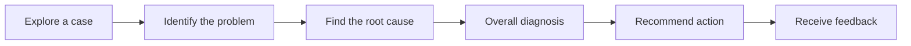
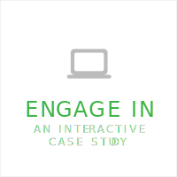
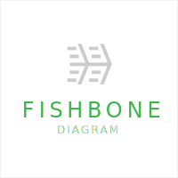
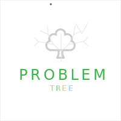

# Problem-Diagnosis Case

Across disciplines, qualified professionals are distinguished by their ability to diagnose and solve problems in a variety of circumstances.

The learner's objective in a Problem-Diagnosis Case is to:

1. Identify the root cause of the problem
2. Evaluate potential solutions using a criteria-based approach
3. Plan for contingencies
4. Recommend the best course of action

# Pattern Structure

## 1. Explore a case
Select one or more of the following compatible modalities to enable learners to explore a case. 

## 2. Identify the problem
- What problem does the case describe? (Problems are the effects of causes such as actions, processes, activities, or forces. Problem scenarios often concern business pathology.)
- What questions will help you explore the problem and its causes?
- Can you identify concepts of frameworks you have learned that might be useful for identifying and proving causes?
  

- [Context Mapping](https://www.sessionlab.com/methods/context-map)
- [History Mapping](https://www.sessionlab.com/methods/history-map-adifpm)
- [Gap Analysis](https://www.sessionlab.com/methods/gap-analysis)

## 3. Find the root cause

  
## 4. Overall diagnosis
- [Impact / Effort Matrix](https://www.sessionlab.com/methods/impact-and-effort-matrix)
- [SWOT Analysis](https://www.sessionlab.com/methods/swot-analysis)

## 5. Recommend action

## 6. Receive feedback
