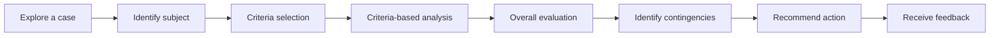

# Problem-Diagnosis Case

```mermaid
  flowchart LR;
      A[Explore a case]-->B[Identify subject];
      B[Identify subject]-->C[Criteria selection];
      C[Criteria selection]-->D[Criteria-based analysis];
      D[Criteria-based analysis]-->E[Overall evaluation];
      E[Overall evaluation]-->F[Identify contingencies];
      F[Identify contingencies]-->G[Recommend action];
      G[Recommend action]-->H[Receive feedback];
```

# Pattern Structure
## 1. Explore a case
## 2. Define problems with
## 3. Causal analysis
## 4. Overall diagnosis
## 5. Recommend action
## 6. Receive feedback