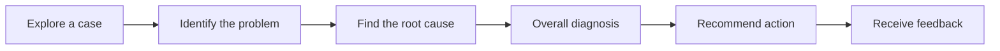
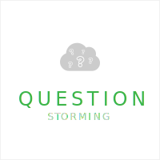

# Problem-Diagnosis Case

Across disciplines, qualified professionals are distinguished by their ability to diagnose and solve problems in a variety of circumstances.

The learner's objective in a Problem-Diagnosis Case is to:

1. Identify the root cause of the problem
2. Evaluate potential solutions using a criteria-based approach
3. Plan for contingencies
4. Recommend the best course of action

# Pattern Structure

## 1. Explore a case
Select one or more of the following compatible modalities to enable learners to explore a case. 

## 2. Identify the problem
- What problem does the case describe? (Problems are the effects of causes such as actions, processes, activities, or forces. Problem scenarios often concern business pathology.)
- What questions will help you explore the problem and its causes?
- Can you identify concepts of frameworks you have learned that might be useful for identifying and proving causes?
  

## 3. Find the root cause
- [Fishbone diagram](https://www.sessionlab.com/methods/fishbone-diagram)
- [5 Whys](https://en.wikipedia.org/wiki/Five_whys)
- [Problem Tree](https://www.sessionlab.com/methods/problem-tree)
  
## 4. Overall diagnosis

## 5. Recommend action
- Eisenhower Decision Matrix

## 6. Receive feedback
