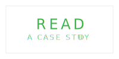
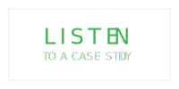

# Problem-Diagnosis Case

```mermaid
  flowchart LR;
      A[Explore a case]-->B[Identify subject];
      B[Identify subject]-->C[Criteria selection];
      C[Criteria selection]-->D[Criteria-based analysis];
      D[Criteria-based analysis]-->E[Overall evaluation];
      E[Overall evaluation]-->F[Identify contingencies];
      F[Identify contingencies]-->G[Recommend action];
      G[Recommend action]-->H[Receive feedback];
```

Across disciplines, qualified professionals are distinguished by their ability to diagnose and solve problems in a variety of circumstances.

The learner's objective in a Problem-Diagnosis Case is to:

1. Identify the root cause of the problem
2. Evaluate potential solutions using a criteria-based approach
3. Plan for contingencies
4. Recommend the best course of action

# Pattern Structure

## 1. Explore a case
Select one or more of the following compatible modalities to enable learners to explore a case. 

## 2. Define problems with

## 3. Causal analysis

## 4. Overall diagnosis

## 5. Recommend action

## 6. Receive feedback
