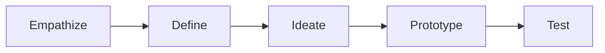

# Design Thinking

# Pattern Structure

A learning experience implementing the Design Thinking pattern typically follows the structure:

Quick Links

- [Empathize](#empathize)
- [Define](#define)
- [Ideate](#ideate)
- [Prototype](#prototype)
- [Test](#test) 

## Empathize

## Define

## Ideate

## Prototype

## Test

# Resources 
- [Design Better](https://www.designbetter.co/) - Free books, audiobooks, podcast, and blogs about design.
- [Nielsen Norman Group](https://www.nngroup.com/reports) - World leaders in research-based user experience. 
- [Design Kit](https://www.designkit.org) - The Field Guide to Human-Centered Design, created by the leading design firm, IDEO.