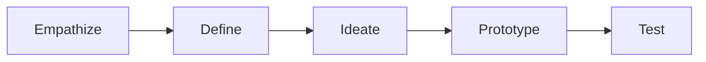

# Design Thinking

# Pattern Structure

A learning experience implementing the Design Thinking pattern typically follows the structure:

| [1. Empathize](#empathize) | [2. Define](#define) | [3. Ideate](#ideate) | [4. Prototype](#prototype) | [5. Test](#test) |
| -------------------------- | -------------------- | -------------------- | -------------------------- | ---------------- |

## Empathize

## Define

## Ideate

## Prototype

## Test
