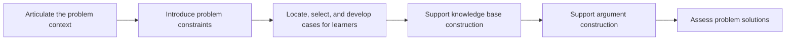

# Ill-Structured Problem
Ill-structured problems, are the kinds of problems that are encountered more often in everyday and professional practice, so they are typically emergent. Because they are not constrained by the content domains being studied in classrooms, their solutions are not predictable or convergent. lll-structured problems may also require the integration of several content domains (Jonassen, 2000, p. 67).
# Pattern Structure

1. Articulate the problem context
2. Introduce problem constraints
3. Locate, select, and develop cases for learners 
4. Support knowledge base construction
5. Support argument construction
6. Assess problem solutions