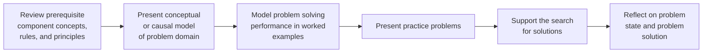

# Well-Structured Problem
Well-structured problems require the application of a finite number of concepts, rules, and principles being studied to a constrained problem situation. These problems have been referred to as transformation problems (Greeno, 1978), which consist of a well-defined initial state (what is known), a known goal state (nature of the solution well defined), and a constrained set of logical operators (known procedure for solving) (Jonassen, 2000, p. 67).
# Pattern Structure

1. Review prerequisite component concepts, rules, and principles
2. Present conceptual or causal model of problem domain
3. Model problem solving performance in worked examples
4. Present practice problems
5. Support the search for solutions
6. Reflect on problem state and problem solution