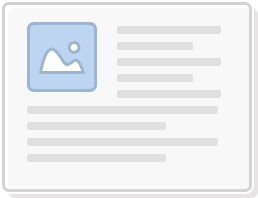
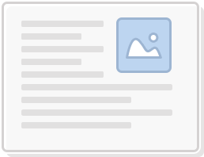
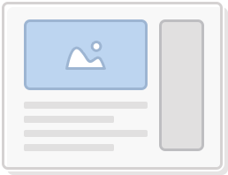
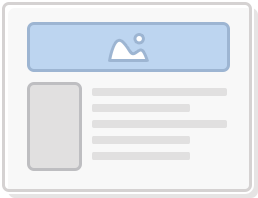

# Article

- [Article](#article)
  - [Article with Full-width Header Image](#article-with-full-width-header-image)
    - [Compatibility](#compatibility)
    - [Required xBlocks: Image, [Text](../xBlocks/Text.md)](#required-xblocks-image-text)
    - [xBlocks Required](#xblocks-required)
  - [Article with Left-aligned Image](#article-with-left-aligned-image)
  - [Article with Right-aligned Image](#article-with-right-aligned-image)
  - [Article with Header Image and Right Sidebar](#article-with-header-image-and-right-sidebar)
  - [Article with Full-width Header Image and Left Sidebar](#article-with-full-width-header-image-and-left-sidebar)
  - [Article with Text Header](#article-with-text-header)
  - [Article with Text Header and Right Sidebar](#article-with-text-header-and-right-sidebar)

## Article with Full-width Header Image

### Compatibility

### Required xBlocks: [Image](../xBlocks/Image.md), [Text](../xBlocks/Text.md)

### xBlocks Required

## Article with Left-aligned Image

## Article with Right-aligned Image

## Article with Header Image and Right Sidebar

## Article with Full-width Header Image and Left Sidebar

## Article with Text Header

## Article with Text Header and Right Sidebar

